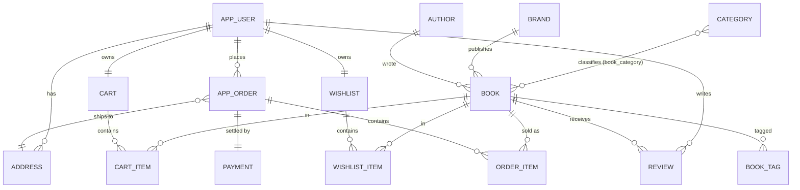

# Book Worm — Data Model

This document describes the persistence model for the Book Worm e-bookstore. It is
the paired human-readable form of the authoritative DDL, which will live in
`backend/src/main/resources/db/migration/V1__init.sql`.

**Rules of the road**
- All monetary amounts are stored as **integer paise** (₹ × 100). No floats.
- All timestamps are `TIMESTAMPTZ` (UTC in DB, rendered in local time by the UI).
- Foreign keys use `ON DELETE CASCADE` when the child row is meaningless without
  the parent (e.g. `cart_item` without `cart`), and `ON DELETE SET NULL` when the
  relationship is looser (e.g. `book.author_id` — orphaning is preferable to
  losing the book row).

---

## Entity–relationship diagram

---

## Entities

### `app_user`
The account. `email` is unique and case-insensitive at the application layer. The
`role` column separates browsing guests, paying customers, and admins; roles are
enforced at both the JWT-claim level and via Spring Security method annotations.
`gift_points` is the current unspent balance — earned when orders are delivered,
spent on checkout.

### `address`
Multiple shipping addresses per user. Exactly one may have `is_default = true` per
user; this invariant is enforced in the service layer (`AddressService.setDefault`)
so we don't need a partial-unique index. Country defaults to `India` since the
capstone targets Indian rupees.

### `category`
Hierarchical (via nullable `parent_id`) to support future subcategories, but the
current wireframe uses only top-level categories. `slug` is the URL-safe form used
in query params (`?category=self-help`).

### `brand`
The publisher label (Penguin Random House, HarperCollins, ...). Called "brand" in
code to match the architecture slide's terminology, but rendered as "Publisher" in
the UI.

### `author`
Book author. Separate from `app_user` — authors are content, users are accounts.
An author may not have a corresponding user account.

### `book`
The core catalog entity. `price_paise` is authoritative; the frontend never sends
a price back to the server (prices are read-only from the client's perspective).
`stock` is decremented atomically at checkout inside a `SELECT ... FOR UPDATE`
transaction to prevent double-selling the last copy. `copies_sold` is a cached
counter maintained by `OrderService.markPaid()` and used to rank bestsellers +
related products.

### `book_category`
Many-to-many join between `book` and `category`. A book can belong to more than
one category (e.g. a self-help memoir).

### `book_tag`
Free-form tags per book (`fiction`, `thriller`, `award-winner`). Used for
faceted search and cross-sell rails beyond the primary category taxonomy.

### `review`
One review per (book, user) pair — enforced by a composite unique constraint.
Rating is 1–5 integer stars. Reviews are shown newest-first on the product page.

### `cart` + `cart_item`
Exactly one cart per user (`user_id` unique). `cart_item` has a composite unique on
(`cart_id`, `book_id`) — adding the same book twice increments quantity rather
than creating a duplicate row. Cart survives across sessions.

### `wishlist` + `wishlist_item`
Symmetric to cart. Same "one per user, unique per book" invariant. Moving from
wishlist to cart is a two-write transaction (insert into `cart_item`, delete from
`wishlist_item`).

### `app_order` + `order_item`
`app_order` is the header row (totals, status, address snapshot pointer). Money
columns are stored **at the moment of checkout** and never recomputed — this is
critical so that a later book price change doesn't rewrite historical orders.
`price_at_purchase` on `order_item` captures the per-line price at that moment.

`status` values (see `V1__init.sql` CHECK constraint): `PENDING`, `PAID`,
`SHIPPED`, `DELIVERED`, `CANCELLED`, `RETURNED`. See the plan file
`Order status transitions` section for the legal transition graph.

`cancellable_until` is set to `created_at + 48 hours` at insert time and never
updated. `OrderService.cancel()` compares `now() < cancellable_until` for the
window check; storing it as an absolute timestamp (rather than recomputing on
every request) makes the invariant queryable via SQL and immune to server clock
drift between reads.

### `payment`
One row per successful or attempted payment against an order. `method`, `status`,
and `transaction_ref` are captured verbatim from the mock gateway. A single order
may have multiple payment rows (retries after `DECLINED`) but exactly one
`SUCCESS` row — enforced by a partial unique index applied only when
`status = 'SUCCESS'` (see V1 migration).

---

## Derived / cached values

| Field | Where | Refreshed by |
|---|---|---|
| `book.copies_sold` | `book` table | `OrderService.markPaid()` on transition PENDING→PAID |
| `book.rating` | `book` table | `ReviewService.recomputeRating(bookId)` after any review write |
| Homepage bestsellers | RTK Query cache (5-min TTL) | Ordered by `copies_sold DESC` on read |
| Homepage recommendations | Not cached — per-user | `OrderHistoryRecommender.recommend(userId)` on each request |

Caching is deliberately conservative in v1 — Postgres is fast enough and cache
invalidation is where the bugs live.

---

## Auditing (deferred)

Every write-heavy table (`app_user`, `book`, `app_order`, `payment`, `review`)
should eventually grow `updated_at` and `updated_by` columns plus a Hibernate
`@EntityListeners(AuditingEntityListener.class)` hook. Deferred to a v2 migration
to keep the initial DDL readable — the tables are ready for it (all inherit from
a common `AuditableEntity` base class in `common/`).
